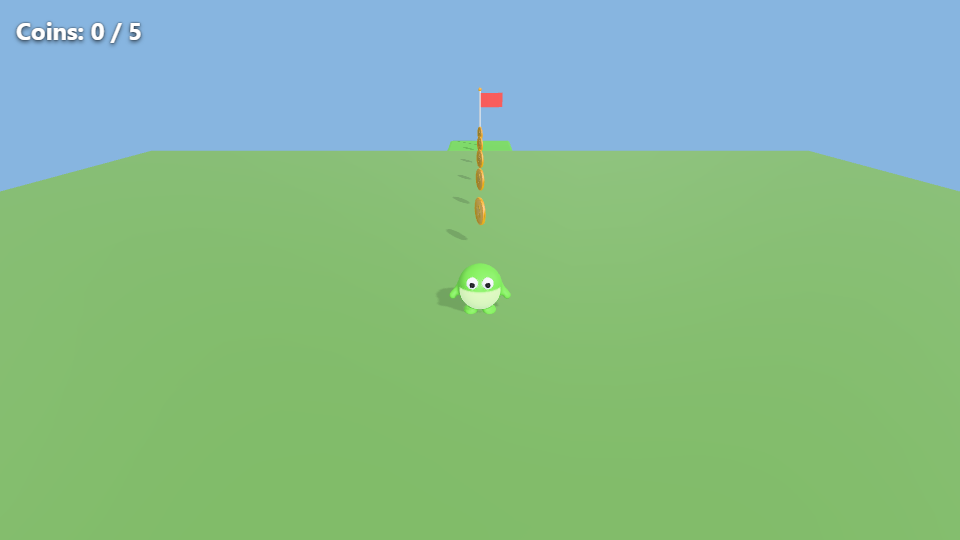

# Coin platformer, built by a local model

This game was built **autonomously by `qwen3.8:27b` running locally in Ollama**, through AIGE's in-editor agent loop (`aige agent`). No human edits.



## The prompt
> Build a small 3D coin platformer game. Requirements: a player character (use the blob-character template) that walks with the built-in PlayerController and a CharacterController, tagged Player; the camera follows the player (builtin:FollowCamera on Main Camera); 5 collectible coins (coin template, trigger sphere collider, builtin:Collectible, tag Coin) placed in a path; a platform (platform template) with a goal flag (flag template) on it with builtin:Goal requireAll Coin; a score HUD (UIText id score + builtin:HudText format 'Coins: {score} / 5'). Then run scene_validate, play-test with game_run_headless walking forward, and fix problems. Finish with export_web.

## What the agent did (21 tool calls)
1. Read the scripting docs.
2. Created four models from templates.
3. Kept a 7-step plan up to date as it worked.
4. Placed the player, camera follow, 5 coins, the platform, the goal and the HUD.
5. Ran `scene_validate`.
6. Play-tested twice, lowering the platform after the first run.
7. Exported the web build.

## Verified
A headless play-test walking forward and jumping at the platform collects **5 / 5 coins** and reaches the goal: `You win!`, with no script errors.

## Play it
```bash
node apps/cli/bin/aige.mjs call export_web '{}' -p examples/coin-platformer-qwen
# then open examples/coin-platformer-qwen/dist/index.html
```

`commands.jsonl` is the agent's full command log. `aige replay` rebuilds the project from it, and CI replays it to make sure engine changes don't break AI-made games.
