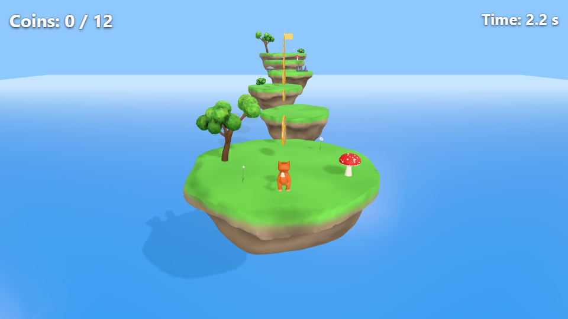
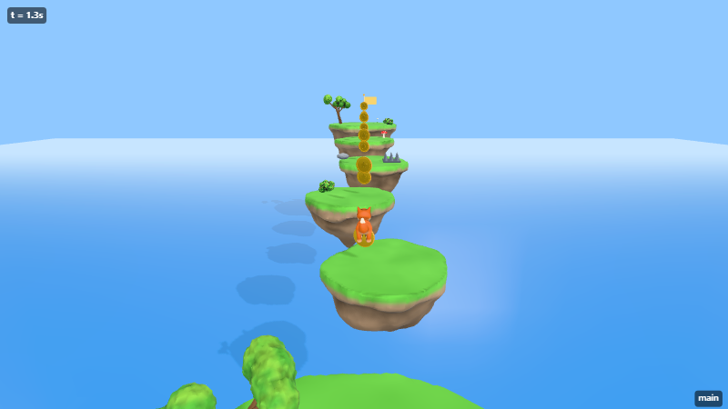
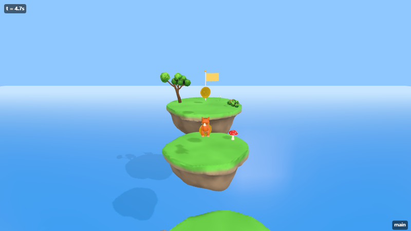
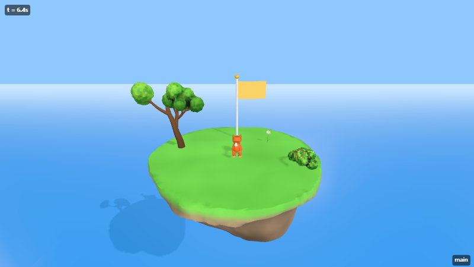

# Sky Coins: the v0.1 acceptance game

A floating-island coin platformer built **entirely through AIGE's AI tools**: the same calls Claude Code makes over MCP. Nothing was hand-edited. The modeling, level building, scripting, verification and export all went through tools. The full record is in `commands.jsonl`.



## What's in it
| Requirement | How it was built |
|---|---|
| Custom organic platforms | `models/sky-island.model.ts`: an SDF recipe written by the AI (smooth-unioned cap + crag + lumps, domain warp, flat grassy top, AO), parameterized by width/depth/seed. The first preview came out all green; the AI saw it and fixed the coloring. |
| SDF player with eyes | `creature` template (fox): SDF chains for legs and tail, glossy eyes |
| Coins with embossing | `coin` template (lathe rim + extruded star) |
| Goal flag | `flag` template with a yellow cloth |
| Movement + camera | `CharacterController` + `builtin:PlayerController`, `builtin:FollowCamera` |
| 12 coins + score UI | 7 on islands and 5 floating over the gaps (placed on the apexes of the measured jump arcs), `builtin:Collectible`, `UIText` + `builtin:HudText` |
| Custom script | `scripts/level-timer.ts`: a HUD timer that freezes on win (type-checked by `script_write`) |
| Respawn on fall | The islands float over the sea; the scene's `killY: -7` plus `PlayerController.respawnOnFall` |
| Hazard | Spike trap with `builtin:Hazard` (respawn) |
| Win condition | `builtin:Goal { requireAll: 'Coin' }` |

## How the AI verified it
1. `scene_validate`: no errors.
2. `game_run_headless` holding forward only: measured the speed (6 m/s) and the point where the fox falls off the first island.
3. Computed jump times from the jump physics, then play-tested with scripted jumps: every island landed and all ground coins were collected.
4. Read the trajectory (`sampleRate: 10`) and placed the 5 air coins on the jump apexes.
5. Final play-test: **12 / 12 coins, "All 12 coins! You win!" at 6.6 s**, no script errors, timer "Finished in 6.6 s".
6. `export_web`: the smoke test ran 124 frames with zero errors on the GPU.

```json
{"seconds":10,"inputs":[{"at":0,"axis":"move_y","value":1},{"at":0.8,"action":"jump"},{"at":1.965,"action":"jump"},
 {"at":3.05,"action":"jump"},{"at":4.22,"action":"jump"},{"at":5.13,"action":"jump"}]}
```

| t = 1.3 s | t = 4.7 s | t = 6.4 s |
|---|---|---|
|  |  |  |

## Play it
```bash
node apps/cli/bin/aige.mjs call export_web '{"title":"Sky Coins"}' -p examples/coin-platformer
# open examples/coin-platformer/dist/index.html   (WASD/arrows + Space, R to restart)
```

Building it exposed several engine improvements, which were made along the way:
- jump buffering in `PlayerController`;
- a `sampleRate` option for play-test probes;
- smarter screenshot framing and labels;
- the kill-height check in `scene_validate` now only applies to moving entities.
